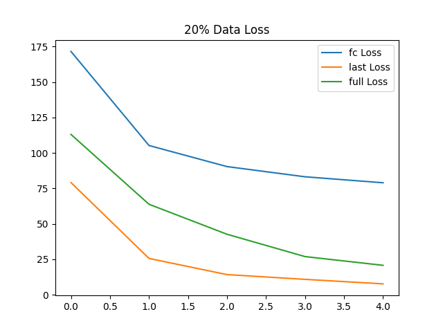
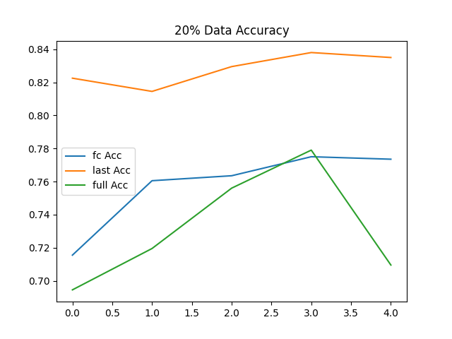
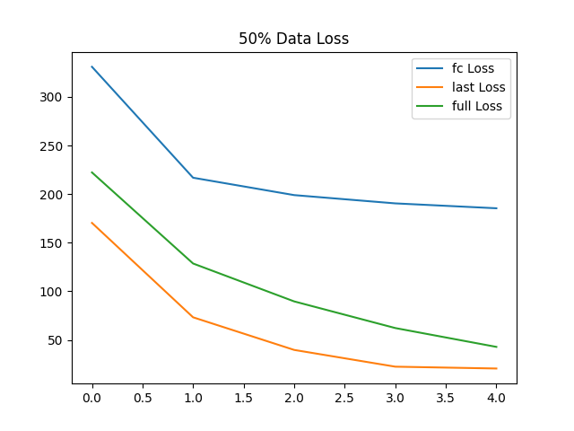
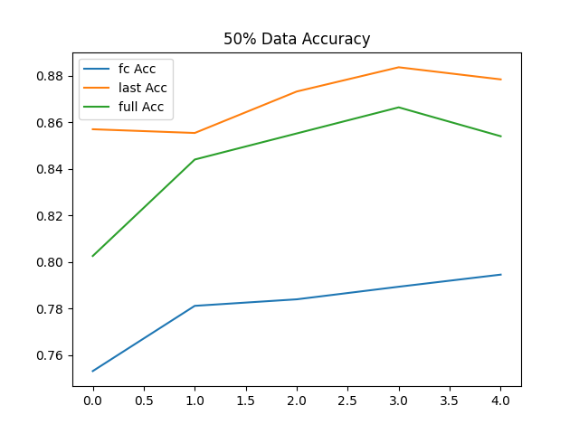
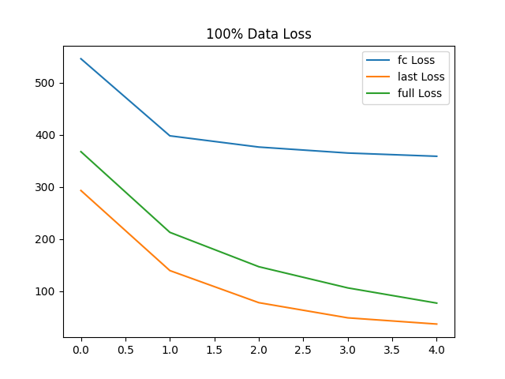
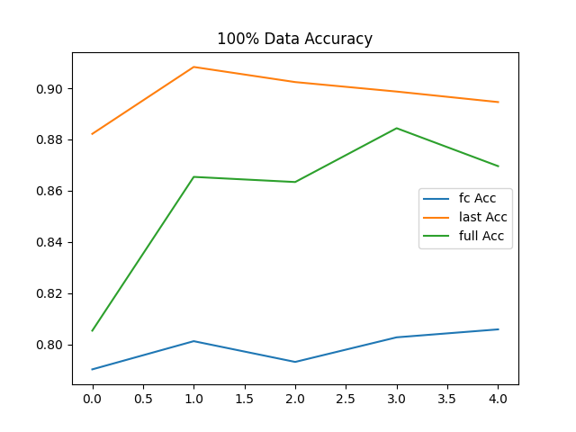

# Fine-Tuning ResNet18 with Varying Data Sizes on CIFAR-10

A comprehensive study analyzing the performance of different fine-tuning strategies (FC Only, Last Block, and Full Fine-Tuning) on the CIFAR-10 dataset using varying amounts of training data (20%, 50%, and 100%).

## 📋 Project Overview

This project investigates how:
- **Dataset size** affects model performance
- **Fine-tuning strategies** impact the learning process
- **Transfer learning** can be optimized for different data regimes

The study uses ResNet18 pretrained on ImageNet and compares three fine-tuning approaches across three dataset sizes.

## 🎯 Key Findings

| Strategy | 20% Data | 50% Data | 100% Data |
|----------|----------|----------|-----------|
| FC Only | 77.50% | 79.46% | 80.59% |
| **Last Block (Best)** | **83.80%** | **88.36%** | **90.83%** |
| Full Fine-Tuning | 77.90% | 86.64% | 88.44% |

**Best Overall Performance:** 90.83% accuracy (Last Block strategy with 100% data)

## 📁 Project Structure

```
├── README.md                          # This file
├── requirements.txt                   # Python dependencies
├── .gitignore                         # Git ignore rules
├── main.py                            # Main training script
├── config.py                          # Configuration file
├── models/                            # Trained model checkpoints
│   ├── 20_fc_best.pth
│   ├── 20_last_best.pth
│   ├── 20_full_best.pth
│   ├── 50_fc_best.pth
│   ├── 50_last_best.pth
│   ├── 50_full_best.pth
│   ├── 100_fc_best.pth
│   ├── 100_last_best.pth
│   └── 100_full_best.pth
├── plots/                             # Generated performance plots
│   ├── 20_Data_loss.png
│   ├── 20_Data_acc.png
│   ├── 50_Data_loss.png
│   ├── 50_Data_acc.png
│   ├── 100_Data_loss.png
│   └── 100_Data_acc.png
├── results/                           # Results and reports
│   ├── results.json                   # Numerical results
│   └── REPORT.md                      # Detailed analysis report
└── data/                              # CIFAR-10 dataset (auto-downloaded)
    └── cifar-10-batches-py/
```

## 🚀 Quick Start

### Prerequisites

- Python 3.8+
- CUDA 11.8+ (for GPU acceleration, optional but recommended)

### Installation

1. **Clone the repository:**
```bash
git clone https://github.com/yourusername/finetuning-varying-data-cifar10.git
cd finetuning-varying-data-cifar10
```

2. **Create a virtual environment:**
```bash
python -m venv venv
source venv/bin/activate  # On Windows: venv\Scripts\Activate.ps1
```

3. **Install dependencies:**
```bash
pip install -r requirements.txt
```

### Running the Experiment

To train all models and generate results:

```bash
python main.py
```

This will:
- Download CIFAR-10 dataset automatically
- Train 9 models (3 strategies × 3 data sizes)
- Generate performance plots
- Save results to `results/results.json`
- Save model checkpoints to `models/`

Expected runtime: ~30-45 minutes on GPU, longer on CPU

### Running Custom Experiments

Edit `config.py` to customize:
- Dataset sizes
- Number of epochs
- Learning rate
- Batch size
- Model architecture

```python
CONFIG = {
    'data_percentages': [0.2, 0.5, 1.0],  # Data sizes to test
    'epochs': 5,                           # Training epochs
    'batch_size': 64,
    'learning_rate': 0.001,
    'device': 'cuda',                      # or 'cpu'
}
```

## 📊 Results Summary

### Performance by Strategy

**Last Block + FC (Winner):**
- Consistent best performance across all dataset sizes
- 13.33% improvement from 20% to 100% data
- Best data efficiency on small datasets
- Most stable performance

**Full Fine-Tuning:**
- Strong performance on 50%+ data
- 10.54% improvement from 20% to 100% data
- May overfit on smaller datasets
- Competitive with Last Block on large datasets

**FC Only (Baseline):**
- Lowest performance across all sizes
- Only 3.09% improvement with more data
- Frozen pretrained features limit adaptability
- Not recommended for this task

### Detailed Analysis

See [results/REPORT.md](results/REPORT.md) for:
- Comprehensive results tables
- Performance visualizations
- Detailed strategy comparison
- Training insights and recommendations
- Practical guidelines for model selection

## 🔬 Experimental Setup

**Model:** ResNet18 (pretrained on ImageNet)

**Dataset:** CIFAR-10 (60,000 32×32 color images, 10 classes)

**Data Splits:**
- 20% subset: 10,000 training samples
- 50% subset: 25,000 training samples
- 100% subset: 50,000 training samples
- Train/Val split: 80/20

**Fine-Tuning Strategies:**
1. **FC Only:** Train only the classifier layer (fully connected)
2. **Last Block:** Train last residual block + classifier
3. **Full Fine-Tuning:** Train all layers

**Training Config:**
- Optimizer: Adam
- Loss: CrossEntropyLoss
- Learning Rate: 0.001
- Epochs: 5
- Batch Size: 64
- Hardware: GPU (CUDA 11.8)

## 📈 Performance Visualizations

### 20% Data Training Curves



### 50% Data Training Curves



### 100% Data Training Curves



## 💡 Key Insights

1. **Dataset Size Impact:** Increasing training data consistently improves accuracy across all strategies. Last Block strategy benefits most from additional data.

2. **Strategy Superiority:** Last Block + FC provides the optimal balance between:
   - Model capacity (more flexible than FC Only)
   - Regularization (better than Full Fine-Tuning)
   - Data efficiency (strong performance even with 20% data)

3. **Overfitting Risk:** Full Fine-Tuning shows signs of overfitting on smaller datasets, while Last Block maintains better generalization.

4. **Practical Recommendation:** For CIFAR-10 with transfer learning, always use the Last Block strategy for best performance.

## 📦 Model Checkpoints

Best-performing models are available in `models/`:

| Model | Strategy | Data | Accuracy |
|-------|----------|------|----------|
| `20_last_best.pth` | Last Block | 20% | 83.80% |
| `50_last_best.pth` | Last Block | 50% | 88.36% |
| `100_last_best.pth` | Last Block | 100% | 90.83% ⭐ |

Load a pretrained model:
```python
import torch
from main import get_model

model = get_model(num_classes=10)
model.load_state_dict(torch.load('models/100_last_best.pth'))
model.eval()
```


